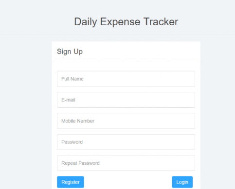

# Daily Expense Tracker

The **Daily Expense Tracker** is a web-based application designed to help users efficiently manage and monitor their daily, monthly, and yearly expenses. With an intuitive interface and comprehensive reporting features, users can easily add, view, and analyze their spending habits over different time periods.

## Features

- **User Registration & Authentication:** Secure login and registration system for individual users.
- **Add Expenses:** Users can add new expenses with details such as date, item, and cost.
- **Manage Expenses:** View, edit, or delete previously added expenses.
- **Expense Reports:**
  - **Daywise, Monthwise, and Yearwise Reports:** Generate detailed reports for any date range, month, or year.
  - **Summary & Grand Total:** Each report provides a summary and grand total of expenses.
- **Dashboard:** Visual summary of today's, yesterday's, last 7 days', last 30 days', current year, and total expenses.
- **Password Management:** Change password and password recovery options.
- **Responsive Design:** Works well on desktops, tablets, and mobile devices.

## Tools & Technologies Used

- **Frontend:** HTML5, CSS3, Bootstrap, Font Awesome
- **Backend:** PHP
- **Database:** MySQL (MariaDB)
- **JavaScript:** jQuery, Chart.js, EasyPieChart
- **Other Libraries:** Flot (for advanced charting), GMaps (for map integration)
- **Server:** XAMPP/WAMP/LAMP (for local development)

## How to Use

### How to run the Daily Expense Tracking System Project

1. **Download** the zip file.
2. **Extract** the file and copy the `dets` folder.
3. **Paste** the `dets` folder inside your web server's root directory:
   - For XAMPP: `xampp/htdocs`
   - For WAMP: `wamp/www`
   - For LAMP: `/var/www/html`
4. **Open PHPMyAdmin** at [http://localhost/phpmyadmin](http://localhost/phpmyadmin)
5. **Create a database** named `detsdb`.
6. **Import** the `detsdb.sql` file (located inside the zip package in the `SQL File` folder).
7. **Run the application** by navigating to [http://localhost/dets](http://localhost/dets) in your browser.

#### Credentials for User Panel

You can use the following credentials to log in, or register a new account yourself:

- **Username:** testuser@gmail.com  
- **Password:** Test@123

## Screenshots

---

**Code by @nkit**
